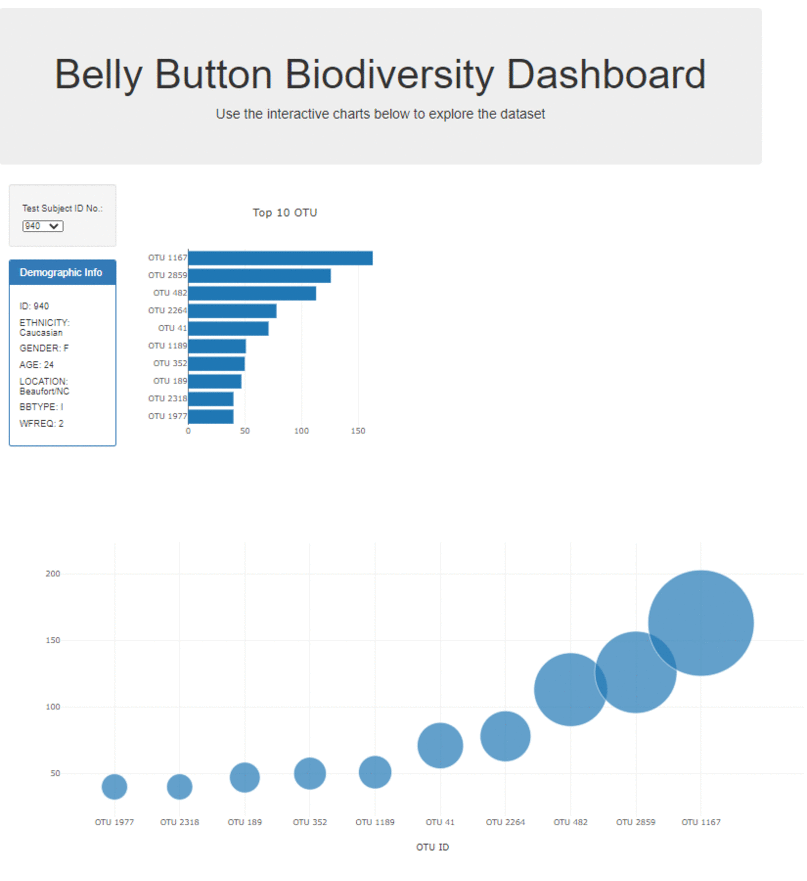

# Plot.ly - Belly Button Biodiversity

### Tech Stack
* JavaScript
* Plot.Ly
* CSS
* HTML
- - -
### User Instructions
* Clone the repository: git clone https://github.com/Vincent-glitch/Plot.ly-Website-Dashboard.git
*  In command: python -m http.server 
*  In web browser: http://localhost:8000/

# Background

Built an interactive dashboard to explore the [Belly Button Biodiversity dataset](http://robdunnlab.com/projects/belly-button-biodiversity/), which catalogs the microbes that colonize human navels.

The dataset reveals that a small handful of microbial species (also called operational taxonomic units, or OTUs, in the study) were present in more than 70% of people, while the rest were relatively rare.
 
